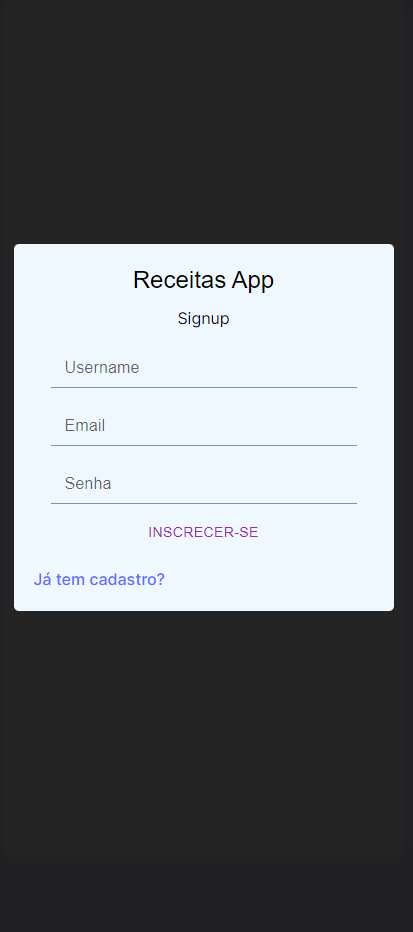
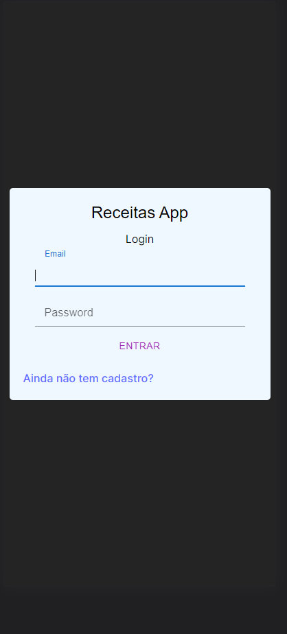
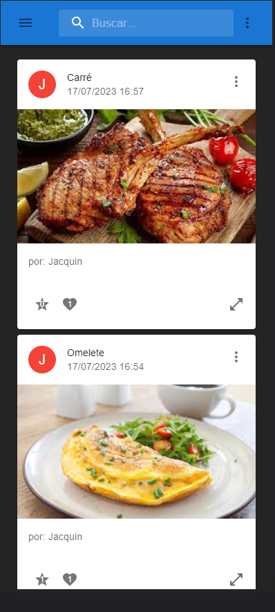
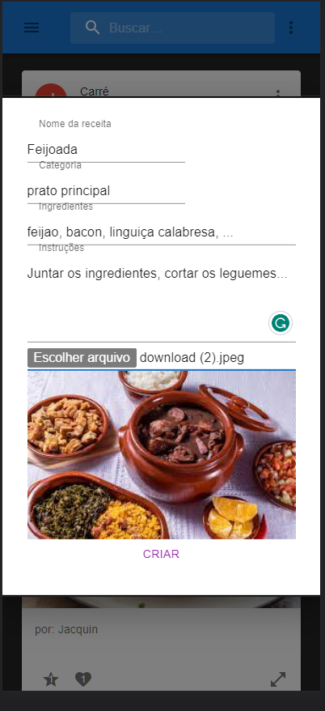
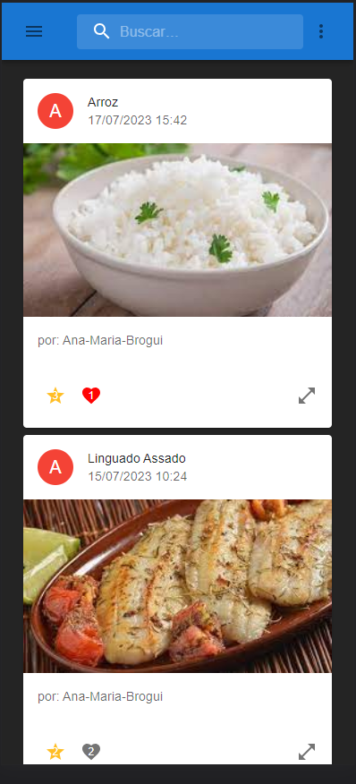
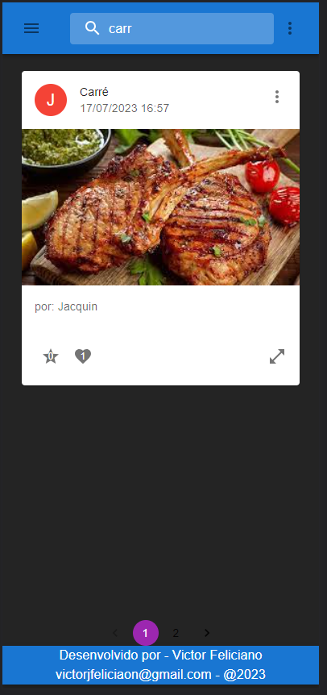
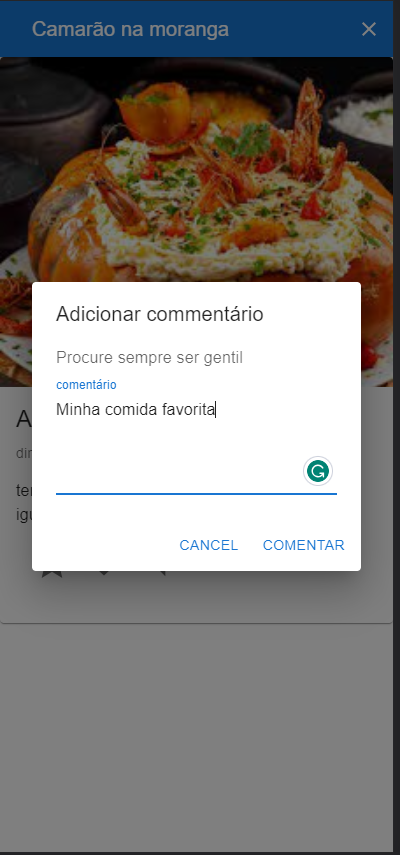
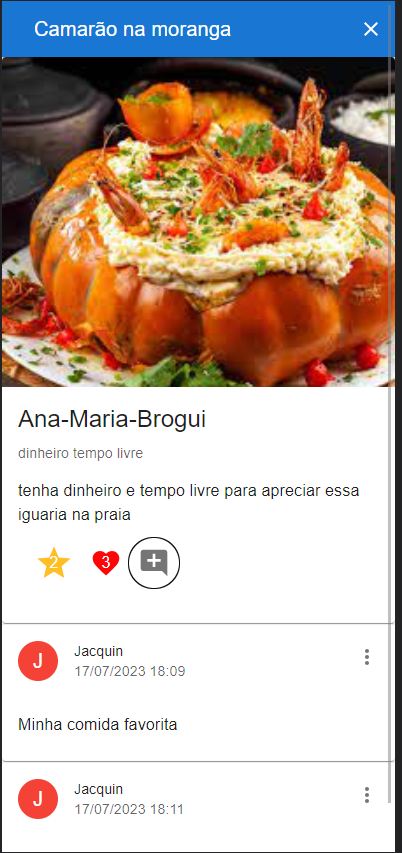

# Receitas app

  ```Aplicação para cadastro e compartilhamento de receitas```

Dê uma olhada: https://receitas-app-frontend.onrender.com
  - OBS: o servidor pode demorar alguns minutos para "acordar" e a aplicação funcionar corretamente

  Responsividade para telas de mobile a desktop!

- Principais tecnologias utilizadas:
  -  React vite com Typescript;
  -  MaterialUi
  -  Axios

## Signup



## Login



## Home



### Criar 



### Favoritar e curtir 



### Pesquisar pelo nome



### Comentar



### Interagir! 


